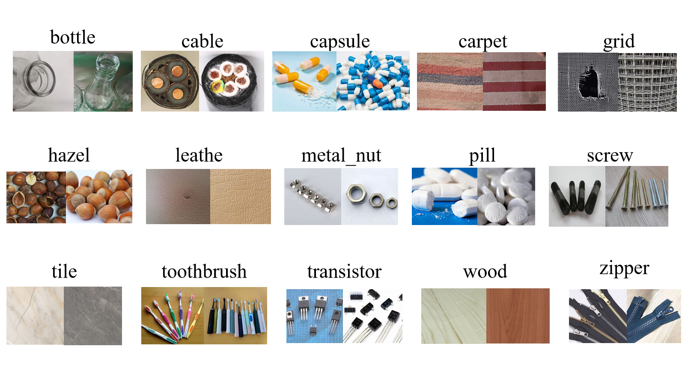

# Efficient Generalization Evaluation of Industrial Anomaly Detection Models via Maximum Discrepancy Competition

## 1. Data Visualization
Part of the data in $\mathcal{[R](https://pan.baidu.com/s/1uquHV-yy2UUth06Vw9txWg?pwd=5555)}$ is as shown in the following image:


## 2. Participating Models (Methods - 6)
- **Simple network structure**: SimpleNet
- **Student - Teacher architecture**: DeSTSeg, Reverse Distillation
- **Normalizing flow**: CFLOW - AD, MSFlow
- **Continuous memory bank**: CRAD

The code corresponding to the above research is in the `methods(6)` folder, and the project folders have the same names as the algorithms. It should be noted that to run the code of each algorithm, you need to first create an Anaconda environment for each project. You can directly build the Anaconda environment for each project by running the following code in the path of each project.

```
conda env create -f environment.yml
```

Testing the data in $\mathcal{R}$ in each project to obtain the test results.

## 3. Maximum Discrepancy Competition
- **Selection of $k$ samples with research value**: ($\mathcal{[D_{ab}](https://pan.baidu.com/s/1QNqnYaLW8Nnml73GFUn7DQ?pwd=5555)}$)
The process involves selecting $k$ samples that have significant research value through the maximumDiscrepency approach.
Execute the following script to implement this:

```
python maximumDiscrepency/MAX_Discrepancy.py
```

## 4. Subjective Experiment and getting the performance on $\mathcal{D_{ab}}$
- **Get the label**:
In the subjective experiment, the main task is to obtain the label for further analysis.

- After obtaining labels for $\mathcal{D_{ab}}$, compute the AUROC scores of $M_a$ and $M_b$ by
running 

```
python carculateScore/CarculateScore
```


## 5. Calculate the ranking results

This section is yet to be filled with the details of calculating and analyzing the results. It will include the methods used for calculation, the key findings from the analysis, and how these results contribute to the overall understanding of the efficient generalization evaluation of industrial anomaly detection models.

First, input the obtained AUROC scores of $M_a$ and $M_b$ on $\mathcal{D_{ab}}$ into the `pairwise_AUROC_dict` in the `global_rank/global_rank.py` file as follows:

```python
pairwise_AUROC_dict = {
    ('CFLOW - AD', 'CRAD'): [0.31334, 0.60439],
    ('CFLOW - AD', 'DeSTSeg'): [0.55263, 0.57046],
    ('CFLOW - AD', 'MSFlow'): [0.58387, 0.48312],
    ('CFLOW - AD', 'Reverse Distillation'): [0.46557, 0.49328],
    ('CFLOW - AD', 'SimpleNet'): [0.33475, 0.65564],
    ('CRAD', 'DeSTSeg'): [0.46988, 0.46619],
    ('CRAD', 'MSFlow'): [0.46606, 0.47104],
    ('CRAD', 'Reverse Distillation'): [0.398, 0.41915],
    ('CRAD', 'SimpleNet'): [0.54634, 0.50426],
    ('DeSTSeg', 'MSFlow'): [0.58341, 0.4294 ],
    ('DeSTSeg', 'Reverse Distillation'): [0.48589, 0.51929],
    ('DeSTSeg', 'SimpleNet'): [0.45564, 0.57235],
    ('MSFlow', 'Reverse Distillation'): [0.46683, 0.51483],
    ('MSFlow', 'SimpleNet'): [0.42976, 0.57518],
    ('Reverse Distillation', 'SimpleNet'): [0.58151, 0.51719]
}
```

Modify the AUROC scores in the dictionary, and then run the following command:

```
python global_rank/lobal_rank.py
```

## Acknowledgement
We would like to express our gratitude for the great contributions from the following repositories:
- [CFLOW-AD](https://github.com/gudovskiy/cflow-ad)
- [MSFlow](https://github.com/cool-xuan/msflow)
- [SimpleNet](https://github.com/donaldrr/simplenet)
- [CRAD](https://github.com/tae-mo/CRAD)
- [DeSTSeg](https://github.com/apple/ml-destseg)
- [Reverse Distillation](https://github.com/hq-deng/RD4AD)
